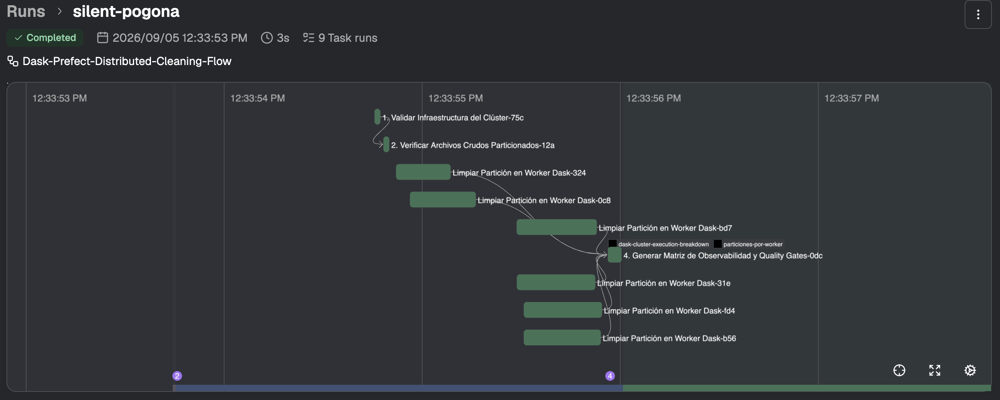
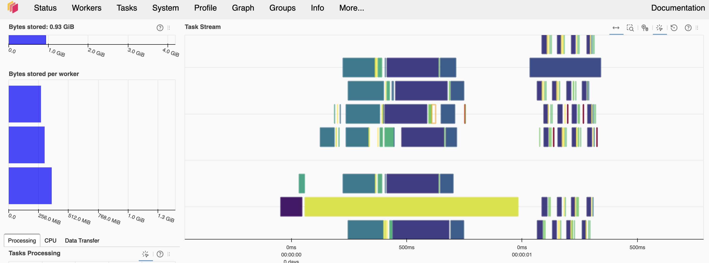

# Computación Distribuida con Dask, Docker & Prefect

Taller de **Arquitectura de Software Avanzada / Sistemas Distribuidos y Big Data**.

## Qué debe hacer el proyecto

Procesar **300.000 registros transaccionales altamente corruptos** en un clúster Dask desplegado sobre Docker, sin cargar nunca el dataset completo en memoria.

Un enfoque monolítico con Pandas exige leer la totalidad del dataset antes de transformarlo, lo que revienta contra el límite de RAM de un solo nodo (*Out-of-Memory*). Aquí se aplica el patrón **Master-Worker** sobre un **grafo acíclico dirigido (DAG)**: el *scheduler* coordina y reparte el trabajo, y tres *workers* independientes procesan particiones en memoria acotada, intercambiando resultados parciales directamente entre ellos (P2P).

El pipeline debe:

1. **Generar** un dataset sintético de 300.000 filas con anomalías inyectadas de forma probabilística (repartido en 6 CSV).
2. **Refactorizar** la columna `raw_customer_code` — que llega con prefijos, guiones, corchetes y espacios parásitos (`  CLI-98234-A  `, `cli_98234_norm`, `RAW#98234-[V2]`) — al formato canónico `CUST-98234`.
3. **Reparar el mojibake**: texto en español con codificación cruzada (UTF-8 leído como Latin-1/Windows-1252) que produce `Bogotá`, `Medellín`, `Operación`.
4. **Normalizar teléfonos** con formatos internacionales caóticos (`+57 (310) 123-4567`, `310.123.4567`, `TEL: 3101234567 Ext 402`, `DESCONOCIDO`).
5. **Orquestar** todo el ciclo con Prefect (`@flow` / `@task`), con *quality gates* de aserción y observabilidad en el Dask Dashboard.
6. **Exportar** el resultado a **Apache Parquet** particionado, no a un CSV concatenado.

## Stack

| Componente | Versión |
|---|---|
| Python | 3.11+ |
| `dask[complete]` | 2026.8.0 |
| `distributed` | (incluido en `dask[complete]`) |
| `prefect` | 3.8.5 |
| `prefect-dask` | 0.3.7 |
| `pandas` / `pyarrow` | última estable |
| Docker + Docker Compose | v2 (`docker compose`, sin guion) |

## Topología del clúster

| Contenedor / Servicio | Rol en el patrón | Puertos expuestos | Recursos asignados |
|---|---|---|---|
| `dask-scheduler` | Master / Coordinador | 8786 (IPC), 8787 (Dashboard) | 1 vCPU, 1 GB RAM |
| `dask-worker-1` | Worker Node 1 | interno (red Docker) | 2 threads, 1.5 GB RAM |
| `dask-worker-2` | Worker Node 2 | interno (red Docker) | 2 threads, 1.5 GB RAM |
| `dask-worker-3` | Worker Node 3 | interno (red Docker) | 2 threads, 1.5 GB RAM |
| `prefect-server` | Orquestador (UI e historial) | 4200 | — |
| `pipeline` | Runner a demanda | — | — |

Los contenedores comparten la red bridge `dask-cluster-net` y el volumen local
`shared-data/`, que emula un sistema de archivos distribuido o Data Lake (S3/GCS).

`pipeline` no arranca con `docker compose up`: está bajo `profiles: ["tools"]` y
se invoca a demanda con `docker compose run --rm pipeline <comando>`.

> **Por qué todo corre dentro de Docker.** Sería natural lanzar el pipeline desde
> tu máquina con `Client("tcp://localhost:8786")`, pero no funciona: quien abre
> los CSV no es tu máquina, son los *workers* dentro de los contenedores, donde la
> ruta es `/shared-data/raw/`. La cadena de ruta debe ser idéntica en el cliente y
> en los workers, y `/shared-data` no se puede crear en la raíz de macOS. Un
> contenedor `pipeline` en la misma red y con el mismo volumen elimina el problema.

> **Cuidado con los dos límites de memoria.** `mem_limit` en Compose es el techo
> que impone el kernel (cgroup); `--memory-limit` en `dask worker` es lo que Dask
> *cree* que tiene. **Deben llevar el mismo valor.** Si el de Dask es mayor, el
> OOM-killer mata el proceso (`killed by signal 9`) antes de que Dask alcance a
> volcar a disco. Los umbrales internos de Dask son porcentajes de
> `--memory-limit`: 60 % → *spill* a disco, 70 % → pausa el worker, 80 % → lo
> reinicia.

## Estructura del proyecto

```
.
├── docker-compose.yml           # 1 scheduler + 3 workers + prefect + runner
├── Dockerfile                   # imagen única para todos los nodos
├── requirements.txt
├── src/
│   ├── cleaning.py              # funciones puras: regex, mojibake, teléfonos
│   ├── generate_dirty_data.py   # generador de las 300.000 filas sucias
│   ├── pipeline_flow.py         # las 9 tareas del flujo Prefect
│   ├── observability.py         # matriz de reparto -> artifacts de Prefect
│   └── verify.py                # comprueba los criterios de aceptación
├── tests/
│   └── test_cleaning.py         # 37 tests sobre las funciones puras
├── images/                      # capturas de evidencia para este README
└── shared-data/
    ├── raw/                     # 6 CSV de entrada (50.000 filas c/u)
    └── processed/               # 6 Parquet de salida
```

## Paso a paso

### 1. Verificar prerrequisitos

```bash
docker --version && docker compose version
```

Se necesita Docker Compose v2. Python en el host **no** hace falta: todo corre
dentro de los contenedores. Comprueba la memoria de la VM de Docker — el clúster
reserva como techo 3 × 1.5 GB + 1 GB = 5.5 GB:

```bash
docker info --format 'Memoria Docker: {{.MemTotal}} bytes | CPUs: {{.NCPU}}'
```

### 2. Construir la imagen

Una sola imagen para scheduler, workers y runner. Compartirla garantiza que las
versiones de Dask coincidan: si difieren, el scheduler rechaza la conexión del
worker.

```bash
docker compose build
```

### 3. Levantar el clúster

```bash
docker compose up -d
```

```bash
docker compose ps
```

Deben aparecer 5 servicios `Up`. Comprueba que los 3 workers se registraron:

```bash
docker compose logs dask-scheduler | grep "Register worker"
```

- Dask Dashboard: <http://localhost:8787/status> → 3 workers, 6 threads.
- UI de Prefect: <http://localhost:4200>

### 4. Correr los tests

Las funciones de limpieza son puras, así que se validan en menos de un segundo.
Depurar el regex aquí es mucho más barato que hacerlo sobre 300.000 filas.

```bash
docker compose run --rm --no-deps pipeline pytest tests/ -q
```

### 5. Generar los datos sucios

```bash
docker compose run --rm --no-deps pipeline python -m src.generate_dirty_data
```

Escribe 6 archivos `transactions_dirty_part_N.csv` (50.000 filas cada uno) en
`shared-data/raw/`, con semilla fija `42` para que el experimento sea
reproducible. Columnas:

| Columna | Contenido |
|---|---|
| `transaction_id` | `TX-0000001` … `TX-0300000` |
| `raw_customer_code` | objetivo de la refactorización; plantillas con pesos: `  CLI-{id}-A  ` (45 %), `cli_{id}_norm` (20 %), `RAW#{id}-[V2]` (15 %), `CUST-{id}-EXP` (10 %), `  {id}  ` (4 %), `ANOMALOUS_STR` (2 %), `INVALID` (2 %), `"   "` (1 %), `None` (1 %) |
| `city_notes_corrupted` | frases en español corrompidas con `.encode('utf-8').decode('latin-1')`, más vacíos y nulos |
| `phone_raw` | 9 formatos heterogéneos, incluidos `DESCONOCIDO`, `N/A`, `--` y cadena vacía |
| `amount_usd` | distribución exponencial (escala 150), con 3 % de `NaN` |
| `business_category` | `FINANCE`, `LOGISTICS`, `RETAIL`, `HEALTH`, `TECH` |

El particionado en 6 archivos es deliberado: un archivo es una partición de Dask,
así que los 3 workers reciben dos chunks cada uno.

### 6. Ejecutar el pipeline

```bash
docker compose run --rm pipeline
```

El flujo `Dask-Prefect-Distributed-Cleaning-Flow` produce **9 task runs**:

```
1. Validar Infraestructura del Clúster
2. Verificar Archivos Crudos Particionados
   ├── Limpiar Partición en Worker Dask   (part_1)
   ├── Limpiar Partición en Worker Dask   (part_2)
   ├── Limpiar Partición en Worker Dask   (part_3)   →   4. Generar Matriz de
   ├── Limpiar Partición en Worker Dask   (part_4)       Observabilidad y
   ├── Limpiar Partición en Worker Dask   (part_5)       Quality Gates
   └── Limpiar Partición en Worker Dask   (part_6)
```



*Grafo real del run en la UI de Prefect. Las dos validaciones iniciales son
secuenciales, las 6 limpiezas corren en paralelo, y todas convergen en la etapa
final — donde cuelgan los dos artifacts (`dask-cluster-execution-breakdown` y
`particiones-por-worker`).*

La clave del diseño está en el abanico del medio: **cada partición es su propia
tarea de Prefect**, no un bucle dentro de una sola tarea. El `DaskTaskRunner`
reparte esas 6 tareas entre los 3 workers, y por eso el grafo del run muestra 6
cajas en paralelo en vez de una caja opaca. Se ve qué worker se llevó cada chunk.

```python
# El abanico, en src/pipeline_flow.py
limpiezas = [limpiar_particion.submit(ruta) for ruta in particiones.result()]
return generar_matriz_y_validar.submit(limpiezas).result()
```

Qué hace cada etapa:

1. **`1. Validar Infraestructura del Clúster`** — comprueba 3 workers y 6 hilos.
   Lleva `retries=3, retry_delay_seconds=10` porque el runner puede arrancar
   antes de que los workers terminen de registrarse.
2. **`2. Verificar Archivos Crudos Particionados`** — localiza los 6 CSV.
3. **`Limpiar Partición en Worker Dask`** ×6 — cada una lee **su** archivo con
   pandas, aplica las tres limpiezas y escribe su propio Parquet. Ningún nodo
   carga más de 50.000 filas: eso es el procesamiento out-of-core.
4. **`4. Generar Matriz de Observabilidad y Quality Gates`** — agrega lo que
   reportó cada worker, publica los artifacts y aplica las aserciones. Si una
   falla, el run queda en `Failed` y se ve en la UI.

Mientras corre, mira el *Task Stream* del Dashboard: las 6 franjas de hilo se
llenan a la vez.

> **Si cambias código en `src/`, reinicia los workers.** Los contenedores son
> procesos de larga vida y Python cachea los módulos ya importados: el worker
> seguirá ejecutando la versión vieja y verás
> `AttributeError: Can't get attribute '...' on module`.
>
> ```bash
> docker compose restart dask-scheduler dask-worker-1 dask-worker-2 dask-worker-3
> ```

### 7. Verificar el resultado

```bash
docker compose run --rm --no-deps pipeline python -m src.verify
```

### 8. Apagar

```bash
docker compose down
```

## Criterios de aceptación

Resultado de la última ejecución sobre las 300.000 filas:

| Criterio | Esperado | Obtenido |
|---|---|---|
| Servicios `Up` | 5 | 5 |
| Workers / hilos | 3 / 6 | 3 / 6 |
| Task runs en Prefect | 9 (con abanico de 6) | 9 |
| Filas de entrada | 300.000 en 6 CSV | 300.000 |
| Filas de salida | 300.000 en 6 Parquet | 300.000 |
| Códigos canónicos `CUST-XXXXX` | — | 281.879 |
| Anomalías marcadas | ~6 % (18.000) | 18.121 |
| Códigos nulos | 0 | 0 |
| Restos de mojibake (`Ã`) | 0 | 0 |
| Teléfonos nulos | ~7 % (21.000) | 20.885 |
| Tamaño CSV → Parquet | reducción notable | 29 MB → 7.6 MB |

Los porcentajes de anomalías cuadran con los pesos del generador: las plantillas
sin id recuperable (`ANOMALOUS_STR`, `INVALID`, `"   "`, `None`) suman 6 %, y los
centinelas de teléfono (`DESCONOCIDO`, `N/A`, `--`, `""`) suman 7 %.

## Observabilidad: qué hizo cada worker y cada hilo

Hay dos vistas y sirven para cosas distintas.

**En vivo — Dask Dashboard (<http://localhost:8787>).** Mientras el pipeline
corre:

| Pestaña | Qué muestra |
|---|---|
| *Task Stream* | una franja por hilo (6 en total), cada tarea como un bloque de color |
| *Workers* | CPU, memoria y bytes almacenados de cada nodo, en tiempo real |
| *Graph* | el grafo de ejecución resolviéndose |
| *Profile* | perfil de CPU por función |



*Las 6 franjas horizontales del Task Stream son los 6 hilos del clúster (3
workers × 2). Cada bloque de color es una tarea; que se solapen en el eje
temporal es la prueba visual de que el trabajo va en paralelo. A la izquierda,
«Bytes stored per worker» muestra las tres barras casi iguales: el reparto está
equilibrado.*

Es la vista más rica, pero **no guarda nada**: al terminar el run desaparece.

**Archivado — Prefect (<http://localhost:4200>).** Por eso la etapa 4 vuelca el
reparto real en *artifacts*, que quedan pegados al run para siempre. Abre un flow
run y mira la pestaña **Artifacts**:

- **`dask-cluster-execution-breakdown`** — cómo se repartió la carga:

  | worker | hilos usados | particiones | filas procesadas | CPU (s) | % de la carga |
  |---|---|---|---|---|---|
  | worker-1 | 2 | 2 | 100.000 | 0.76 | 36.7 |
  | worker-2 | 2 | 2 | 100.000 | 0.57 | 27.6 |
  | worker-3 | 2 | 2 | 100.000 | 0.74 | 35.8 |

- **`particiones-por-worker`** — qué hilo de qué worker procesó cada partición y
  qué produjo:

  | partición | worker | hilo | filas | canónicos | anomalías | mojibake reparado | segundos |
  |---|---|---|---|---|---|---|---|
  | `part_1` | worker-1 | hilo-0 | 50.000 | 46.977 | 3.023 | 47.513 | 0.383 |
  | `part_2` | worker-2 | hilo-0 | 50.000 | 46.946 | 3.054 | 47.463 | 0.255 |
  | `part_3` | worker-3 | hilo-0 | 50.000 | 47.035 | 2.965 | 47.410 | 0.369 |
  | `part_4` | worker-2 | hilo-1 | 50.000 | 46.903 | 3.097 | 47.459 | 0.316 |
  | `part_5` | worker-3 | hilo-1 | 50.000 | 47.033 | 2.967 | 47.494 | 0.373 |
  | `part_6` | worker-1 | hilo-1 | 50.000 | 46.985 | 3.015 | 47.525 | 0.377 |

El reparto sale parejo — 2 particiones y 100.000 filas por nodo — porque el
`DaskTaskRunner` recibe 6 tareas discretas e independientes y las distribuye
round-robin entre los workers disponibles.

Además, cada tarea deja en sus logs de Prefect en qué nodo se ejecutó:

```
[worker-2] procesando transactions_dirty_part_4 en el hilo 281473080750464
[worker-2] transactions_dirty_part_4: 50000 filas en 0.32 s
```

Cómo se implementa, en [src/observability.py](src/observability.py) y la etapa 4
de [src/pipeline_flow.py](src/pipeline_flow.py): cada tarea de limpieza devuelve
un reporte con `worker`, `hilo`, `filas` y `segundos`; la etapa final los agrega
y publica las tablas.

## Demostrar la tolerancia a fallos

Con 300.000 filas el pipeline dura **~3 segundos**: es imposible matar un worker a
tiempo. Para verlo, genera un lote más grande:

```bash
docker compose run --rm --no-deps -e NUM_ROWS=3000000 pipeline python -m src.generate_dirty_data
```

Lanza el pipeline y, a los pocos segundos, en otra terminal:

```bash
docker stop dask-worker-2
```

El flujo termina en `Completed()` igual. En los logs del scheduler se ve la
secuencia completa:

```bash
docker compose logs dask-scheduler | grep -E "Remove worker|Register worker"
```

El scheduler detecta la desconexión, marca como perdidas las tareas de ese nodo y
las reprograma en los workers 1 y 3 recorriendo el DAG hacia atrás hasta la última
dependencia disponible.

Con 3 millones de filas cada partición pesa 500.000 registros y **supera el límite
de 1.5 GB**: verás `Worker process was killed by signal 9` en los logs. Es el
OOM-killer haciendo cumplir `mem_limit`, y el *nanny* de Dask reiniciando el
proceso solo. Segunda demostración de resiliencia, gratis.

## Notas técnicas

- **Por qué una tarea de Prefect por partición.** La alternativa es una sola
  tarea que hace `dd.read_csv(glob)` + `map_partitions` + `to_parquet` por
  dentro. Funciona igual de bien, pero Prefect solo ve **una caja opaca**: el
  paralelismo queda enterrado en el grafo de Dask y no se puede auditar quién
  hizo qué. Con `limpiar_particion.submit(ruta)` por archivo, el
  `DaskTaskRunner` reparte 6 tareas visibles entre los 3 workers y el run queda
  autoexplicativo.
- **Sigue siendo out-of-core.** Cada tarea carga solo su chunk de 50.000 filas
  (~5 MB en memoria), nunca las 300.000. Ese es exactamente el punto: un
  `pd.read_csv` monolítico de todo el dataset es lo que revienta contra el
  límite de RAM.
- **El orden importa al normalizar teléfonos.** La extensión se elimina *antes*
  de extraer dígitos. Si no, `TEL: 3101234567 Ext 402` deja 13 dígitos y se
  descartaría un número perfectamente válido.
- **La reparación de mojibake necesita un guardia.**
  `encode('latin-1').decode('utf-8')` aplicado a texto ya sano lo rompe, así que
  solo se intenta si el texto contiene los marcadores `Ã` o `Â` — los bytes
  `0xC3`/`0xC2` que abren todo carácter latino en UTF-8.
- **Parquet frente a CSV.** Parquet es columnar y comprimido: leer solo
  `amount_usd` no obliga a parsear el resto, y el *predicate pushdown* permite
  filtrar sin descomprimir bloques enteros. Un CSV concatenado se relee completo
  cada vez y pierde los tipos. Aquí: 29 MB → 7.6 MB.
- **Cuello de botella red vs. CPU.** Con 300.000 filas el run entero dura ~3 s y
  buena parte se va en coordinación, no en cómputo. En datasets pequeños un
  proceso mononodo le gana a la arquitectura distribuida — el punto de cruce es
  justamente lo que este taller deja medir con el Dashboard.
